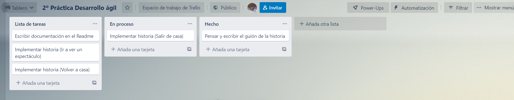

# Práctica 2 - Desarrollo ágil - Marco Antonio Carrión Soriano

## Indice

1. [ Descripción del juego. ](#desc)
2. [ Url de Trello. ](#url)
3. [ Capturas de pantalla. ](#cap)

## Descripción del juego

En esta práctica se ha utilizado Undum para crear un juego interactivo. El juego que he creado cuenta la historia de un chico que ha quedado con sus amigos
para ver una actuación de circo. La pecurialidad de la historia son los sinsentidos que aparecen a lo largo de la misma.

A nivel de programación he intentado utilizar el máximo de aspectos posibles que nos brinda Undum, centrandome sobre todo en enlaces entre escenas para diversificar los distintos sucesos.

## Url Trello

Para esta práctica he utilizado un tablero de Trello donde he organizado en tarjetas las diferentes actividades a realizar. 
La URL de dicho tablero es: https://trello.com/b/mmtWMXac/2-pr%C3%A1ctica-desarrollo-%C3%A1gil

## Capturas de pantalla

La primera captura de pantalla (Imagen 1) que voy a incluir es la del tablero prácticamente al comienzo del proyecto, con las actividades a realizar que planifiqué en el inicio

